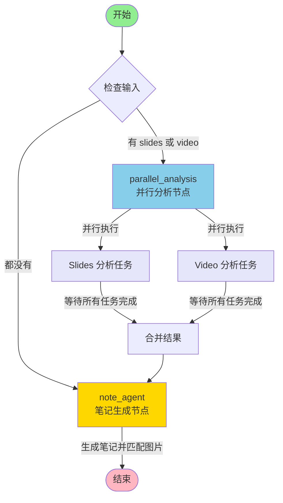
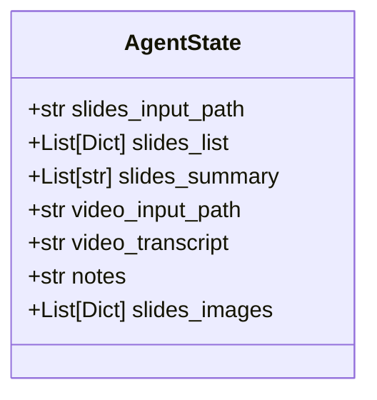

# Graph 执行结构图

## 整体执行流程



## 详细节点说明

### 1. START 节点
- **功能**: 工作流的起始点
- **路由逻辑**: 根据 state 中是否有 `slides_input_path` 或 `video_input_path` 决定路由

### 2. parallel_analysis 节点
- **功能**: 并行执行 slides 和 video 分析
- **执行逻辑**:
  ```
  如果 has_slides:
    创建 slides 分析任务 (异步)
  如果 has_video:
    创建 video 分析任务 (异步)
  
  使用 asyncio.gather() 并行执行所有任务
  合并结果并返回
  ```
- **输出**: 
  - `slides_list`: slides 分析结果列表
  - `video_transcript`: 视频转录文本

### 3. note_agent 节点
- **功能**: 根据 video 和 slides 生成笔记，并匹配相关 slide 图片
- **执行逻辑**:
  ```
  1. 检查是否有 video_transcript 和 slides_list
  2. 构建笔记生成提示
  3. 调用 LLM 生成结构化笔记
  4. 如果有 slides，提取图片并匹配最相关的 slides
  5. 返回笔记和匹配的图片
  ```
- **输出**:
  - `notes`: 生成的笔记内容
  - `slides_images`: 匹配的 slide 图片列表

## 数据流

```mermaid
sequenceDiagram
    participant Start as START
    participant Parallel as parallel_analysis
    participant Slides as Slides 分析
    participant Video as Video 分析
    participant Note as note_agent
    participant End as END
    
    Start->>Parallel: state (包含 slides_input_path/video_input_path)
    
    par 并行执行
        Parallel->>Slides: analyze_presentation(slides_input_path)
        Slides-->>Parallel: slides_list
    and
        Parallel->>Video: asr.invoke(video_input_path)
        Video-->>Parallel: video_transcript
    end
    
    Parallel->>Note: state (包含 slides_list, video_transcript)
    
    Note->>Note: 生成笔记 (LLM)
    Note->>Note: 提取 slide 图片
    Note->>Note: 匹配相关 slides
    
    Note->>End: state (包含 notes, slides_images)
```

## State 字段说明



## 执行场景

### 场景 1: 只有 Slides
```
START → parallel_analysis → [Slides 分析] → note_agent → END
```

### 场景 2: 只有 Video
```
START → parallel_analysis → [Video 分析] → note_agent → END
```

### 场景 3: 同时有 Slides 和 Video (并行执行)
```
START → parallel_analysis → ┌─ [Slides 分析] ─┐
                             │                  │ (并行)
                             └─ [Video 分析] ─┘
                             ↓
                         合并结果
                             ↓
                          note_agent → END
```

### 场景 4: 都没有
```
START → note_agent → END (返回错误信息)
```

## 关键函数

### route_from_start(state: AgentState) -> str
- 检查 state 中是否有 `slides_input_path` 或 `video_input_path`
- 如果有，返回 `"parallel_analysis"`
- 如果没有，返回 `"note_agent"`

### parallel_analysis_node(state, config) -> dict
- 并行执行所有需要的分析任务
- 返回包含 `slides_list` 和/或 `video_transcript` 的字典

### note_agent_node(state, config) -> dict
- 生成笔记
- 匹配相关 slide 图片
- 返回包含 `notes` 和 `slides_images` 的字典

